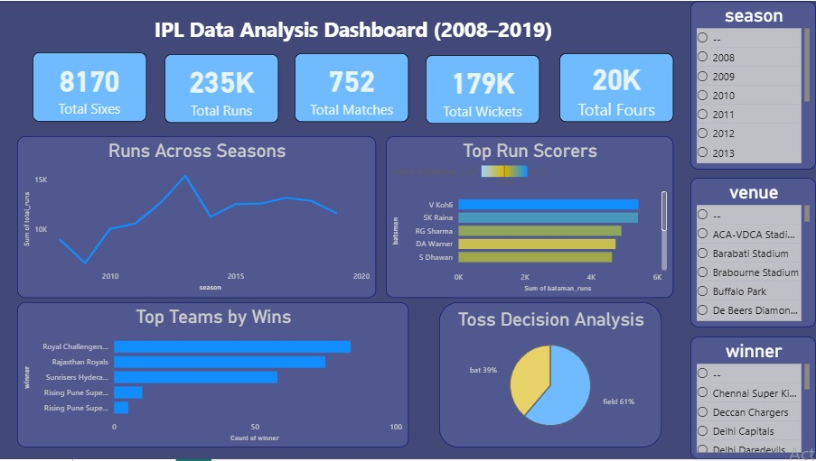

# IPL Data Analysis Dashboard

## Project Overview
This Power BI dashboard analyzes IPL (Indian Premier League) data from 2008 to 2019.

## Dashboard Features
- KPI Cards
- Top Teams by Wins
- Top Run Scorers
- Runs Across Seasons
- Toss Decision Analysis
- Interactive Slicers

## Tools Used
- Power BI Desktop
- Kaggle IPL Dataset

## Dashboard Preview

